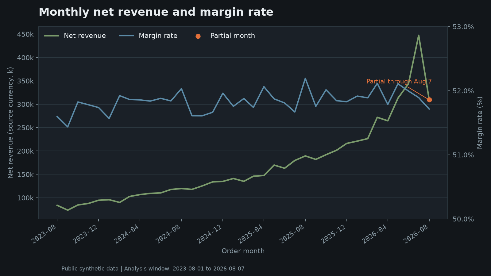
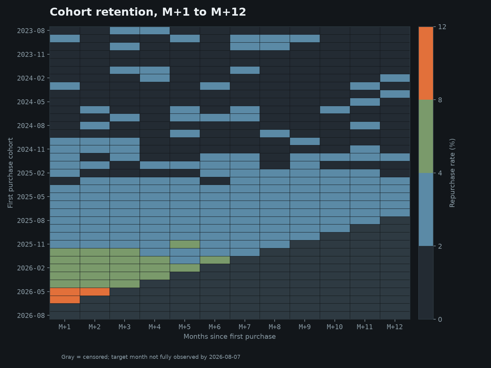

# Outdoor Commerce CRM Decision Lab


공개 합성 패션 커머스 데이터로 매출·고객 행동·CRM 의사결정을 재현하고,
그 숫자를 어디까지 믿을 수 있는지 함께 검증하는 분석 프로젝트입니다.

**완성 목표일: 2026-08-15**
**수행계획서 1쪽:** [reports/plan_onepager_public.pdf](reports/plan_onepager_public.pdf)

---

## 30초 결론

1. **2026년 7월 순매출은 전월 대비 30.1% 증가했고, 원인은 객단가가 아니라 주문량입니다.**
   주문수 +29.6%, 객단가 +0.4%.

2. **분석 구간 유효 주문 72,268건의 매출이 품목 단위와 주문 단위에서 대사됩니다.**
   취소·반품 제외 기준을 명시했고, 마진은 상품 원가 기준입니다.

3. **이 데이터의 리텐션은 실제 운영 기준으로 쓸 수 없습니다.**
   동일 관측기간 24개 코호트 패널에서 M+1 1.97% → M+12 1.84%로 0.13%p만
   감소해 감쇠가 사실상 없습니다. 절대값 기반 액션 타이밍은 산출하지 않았습니다.

---

## 검증된 분석 결과

### 월별 순매출과 마진율



분석 구간은 2023-08-01부터 2026-08-07까지입니다.
이 구간의 전체 주문은 96,277건이고, 취소·반품을 제외한 **유효 주문은 72,268건**입니다.
순매출·주문수·구매고객수·AOV·마진·마진율은 유효 주문 기준이고,
`gross_revenue` 하나만 취소·반품을 포함한 전체 상태 기준입니다.
컬럼별 모집단은 [지표 정의 사전](docs/metric_dictionary.md)에 명시했습니다.

2026년 8월은 7일까지만 관측된 부분월로 표시하고 완전월과 직접 비교하지 않았습니다.

### 코호트 리텐션



첫 구매월 37개, M+1~M+12 셀 444개 중 90개는 대상 월이 2026-08-07 기준으로
완전히 관측되지 않아 NULL로 저장하고 절단 표시했습니다.

개별 관측 셀 354개는 0.46~11.60%로 넓게 분산돼 있습니다.
다만 M+12까지 완전히 관측된 동일 24개 코호트(2023-08 ~ 2025-07)만 짝지어 비교하면,
horizon별 중앙값이 1.67~2.03% 안에 머물고 M+1 1.97% → M+12 1.84%로
0.13%p만 감소합니다.

관측 기간이 다른 코호트를 섞으면 최신 고리텐션 코호트가 M+1에만 포함되어
감쇠가 과대평가됩니다. 그래서 동일 관측기간 패널로만 결론을 냈습니다.

실제 커머스의 리텐션 곡선과 다르며, 가입에서 첫 구매까지 중앙값이 385일이라는
점과 함께 **합성 데이터의 시간 분포 아티팩트**로 판단했습니다.
따라서 절대값 기반 액션 타이밍은 산출하지 않았습니다.
근거는 [데이터 한계 문서](docs/limitations.md)에 정리했습니다.

---

## 비즈니스 질문 5개와 현재 답변 가능 범위

1. **[답변 가능]** 월별 순매출 성장은 주문 증가와 객단가 상승 중 무엇이 이끌었는가
2. **[부분 가능]** 관측 미완료 구간을 절단했을 때 각 첫 구매 코호트의 M+1~M+12 재구매는 어떠한가
3. **[답변 가능]** 취소·반품이 총매출에서 제거하는 금액과 상품 원가 기준 잔여 마진은 얼마인가
4. **[현재 불가]** 어떤 유입채널과 첫 구매 카테고리가 높은 반복구매와 함께 나타나는가
5. **[현재 불가]** 반복구매·마진·반품률을 함께 볼 때 어떤 CRM 대상에 캠페인을 보내야 하는가

2번은 값은 산출했으나 합성 데이터 아티팩트로 절대 해석이 불가합니다.
4번은 컬럼은 존재하나 분석이 아직 구현되지 않았습니다.
5번은 캠페인·처치 필드가 없어 현재 데이터로 인과 효과를 산출할 수 없습니다.
판정 근거는 [비즈니스 문제 정의](docs/business_problem.md)에 있습니다.

---

## 데이터 출처와 고지

출처는 `bigquery-public-data.thelook_ecommerce`이며 프로젝트 범위의
Application Default Credentials로 조회했습니다.
주문 125,158건, 사용자 100,000명, 상품 원가, 반품 상태, 유입채널 5종,
행동 이벤트 2,424,927건을 포함합니다.

**theLook은 공개 합성 데이터이며 실제 기업의 데이터나 성과가 아닙니다.**
캠페인·처치 필드가 없으므로 이 단계에서는 캠페인 효과나 인과적 사업 영향을
보고하지 않습니다. 원본 데이터 파일, 인증정보, 고객명, 이메일, 주소는
저장소에 포함하지 않습니다.

---

## 데이터 한계

이 데이터로 할 수 없는 것을 먼저 밝힙니다.

- 가입에서 첫 구매까지 소요일이 왜곡되어 있습니다. P10 28일, 중앙값 385일, P90 1,439일.
- 코호트 리텐션에 감쇠가 없어 절대값 기반 액션 타이밍을 산출할 수 없습니다.
- 할인 품목이 0/180,066으로 할인 민감 세그먼트를 측정할 수 없습니다.
- 월별 마진율이 51.4~52.2%로 사실상 고정되어 있어 계절성·프로모션 효과를 분석할 수 없습니다.
- 미래 시점의 주문 품목과 이벤트가 각각 1,197건 존재해 `as_of_date=2026-08-07`로 고정했습니다.

정량화된 한계 전문, 타임스탬프 이상, 절단 정책, 매출 대사 결과는
[데이터 한계와 해석 규칙](docs/limitations.md)에 있습니다.

---

## 진행 상태

- [x] 저장소 구조와 공개 위생 정비
- [x] BigQuery 소스 접근과 7개 테이블 스모크 테스트
- [x] 실제 스키마 확보와 분석 구간 확정
- [x] 월별 KPI SQL·CSV·추세 차트
- [x] M+1~M+12 코호트 리텐션 SQL·CSV·히트맵
- [x] 지표 정의 사전과 개인정보 처리 원칙
- [x] 인증 없이 실행되는 산출물 검증 테스트 19종
- [ ] SQL에서 CSV·차트를 재생성하는 실행기와 출력 manifest
- [ ] 고객 세그먼트와 채널·카테고리 리텐션 분해
- [ ] 실험 설계와 의사결정 대시보드

---

## 재현 방법

### 1. 환경 준비

Windows

```
python -m venv .venv
.venv\Scripts\pip install -r requirements.txt
```

macOS / Linux

```
python3 -m venv .venv
.venv/bin/pip install -r requirements.txt
```

### 2. 인증 없이 산출물 검증

GCP 계정 없이 커밋된 CSV·차트·PDF·문서의 정합성을 검증합니다.
스키마, 절단 셀 수, 마진율 파생 관계, 주문 합계, 문서 링크를 검사합니다.

```
python tests/test_offline.py
```

```
offline verification - 19 checks
passed=19 failed=0
```

이 검사는 통과만 시키는 형식 점검이 아닙니다. 예를 들어 리텐션 평탄성 검사는
감쇠 곡선을 넣으면 반드시 실패하도록 별도 테스트로 검증합니다
(`test_flatness_check_actually_rejects_decay`).

### 3. BigQuery 원천 접근 확인 (선택)

`src/smoke.py`는 7개 테이블의 행수와 dry-run 스캔량만 확인합니다.
**분석 SQL을 실행하거나 CSV·차트를 재생성하지는 않습니다.**

PowerShell

```
gcloud auth application-default login
$env:GOOGLE_CLOUD_PROJECT="<본인 GCP 프로젝트 ID>"
python src/smoke.py
```

> **재현성 현황.** 커밋된 CSV와 차트는 BigQuery 실행 결과이지만, 저장소에는
> SQL에서 CSV·차트를 재생성하는 실행기와 출력 manifest가 아직 없습니다.
> 현재 저장소가 보증하는 범위는 커밋된 산출물의 내부 정합성까지입니다.
> `src/run_analysis.py`와 SQL 해시·CSV 해시·BigQuery job ID를 담은
> `reports/manifest.json`은 다음 단계 과제입니다.

### 검토 대상 쿼리와 결과

- [`sql/analysis/01_monthly_kpi.sql`](sql/analysis/01_monthly_kpi.sql) → [`reports/preview/01_monthly_kpi.csv`](reports/preview/01_monthly_kpi.csv)
- [`sql/analysis/02_repeat_rate.sql`](sql/analysis/02_repeat_rate.sql) → [`reports/preview/02_cohort_retention.csv`](reports/preview/02_cohort_retention.csv)

두 쿼리 모두 2023-08-01부터 2026-08-07 구간을 BigQuery Standard SQL로 실행합니다.
순매출 정의와 제외 상태는 각 쿼리 상단 주석에 명시했습니다.

---

## 기술 스택

### 실제 사용 중

- **Python** — 소스 접근과 산출물 검증
- **BigQuery** — theLook 공개 데이터셋 조회와 dry-run 비용 관리
- **SQL** — 월별 KPI와 코호트 리텐션 정의
- **pandas / Matplotlib** — 커밋된 CSV와 차트 생성에 사용. 생성 스크립트는 미커밋
- **pytest** — 인증 없이 실행되는 산출물 검증 19종

### 예정

- 고객 세그먼트와 퍼널 분석
- 실험 설계와 예측 모델
- 의사결정 대시보드와 정기 리포트

---

코드와 문서는 [MIT License](LICENSE)를 따릅니다.
원본 데이터셋은 각 제공자의 별도 약관을 따릅니다.
